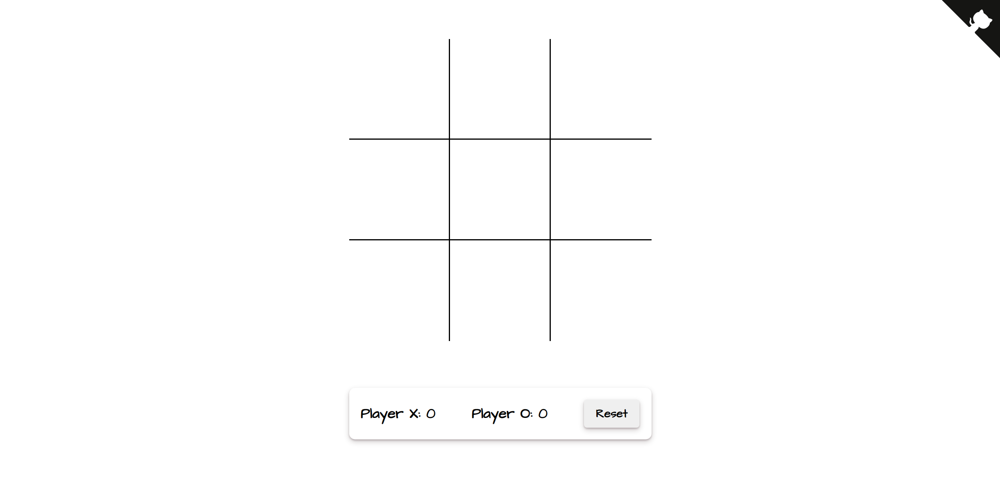

# Tic-Tac-Toe 🥴

A tic-tac-toe web app for fun.

# Table of Contents

- [Technologies Used](#tused)
- [Getting Started](#started)
- [Pre-requisites](#require)
- [Installation](#installation)
- [Screenshot](#screenshot)
- [Hosted web application](#hosted-app)

## Technologies Used<a name="tused"></a>

- HTML
- CSS
- JS

## Getting Started<a name="started"></a>

To install and run this app locally simply follow the instructions below:

#### Pre-requisites<a name="require"></a>

You need to have or install the following:

1. Git bash

#### Installation<a name="installation"></a>

- Clone repo
  ```
  git clone https://github.com/Shreykr/tic-tac-toe.git
  ```
- Navigate to project folder

- You can now open the app from the browser or go live using Live Server (by Ritwick Dey) VS Code extension if you are using this editor.

#### Screenshot



#### Hosted web application<a name="hosted-app"></a>

https://tic-tac-toe-x-o.netlify.app/

## Author

Shreyas K R
